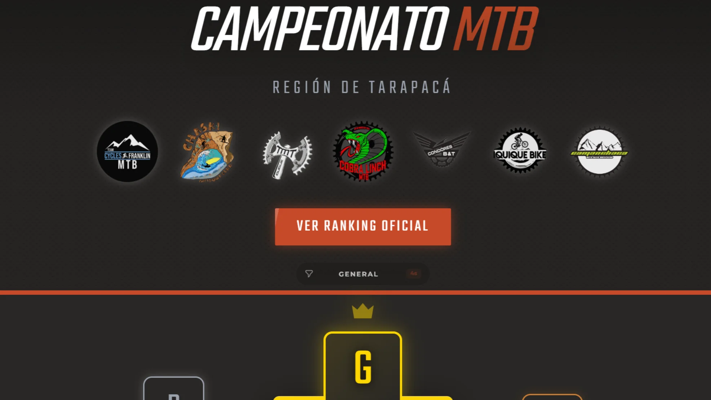
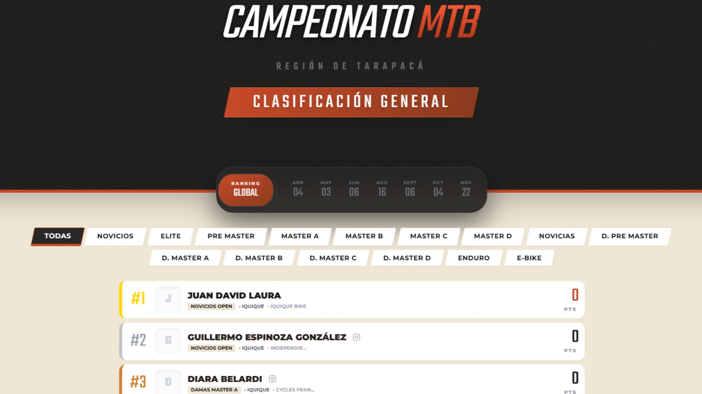
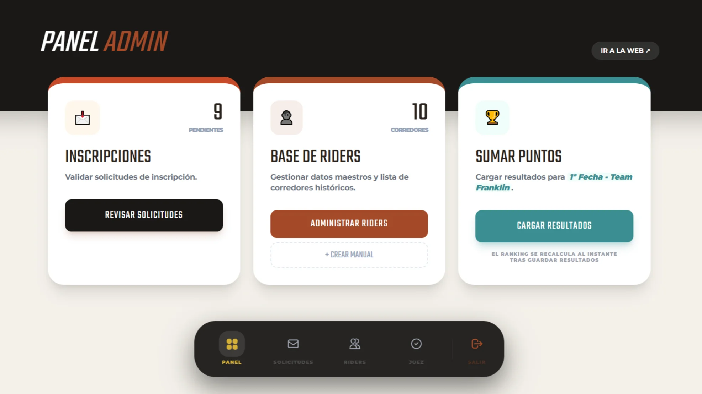
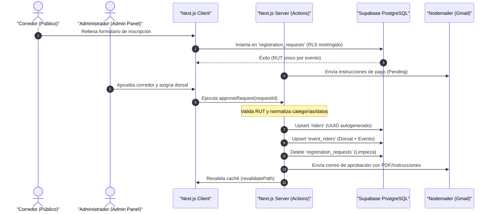

# 🚵‍♂️ Campeonato MTB Tarapacá - Gestión y Leaderboard en Tiempo Real

[](https://nextjs.org/)
[](https://www.typescriptlang.org/)
[](https://supabase.com/)
[](https://tailwindcss.com/)
[](https://nodemailer.com/)

Plataforma full-stack para la gestión de inscripciones, administración de eventos de ciclismo de montaña (MTB) y visualización del ranking global y resultados del **Campeonato MTB Tarapacá**.

El sistema automatiza el cálculo de resultados y clasificación a partir de la carga de archivos, reemplazando la gestión manual en planillas de cálculo.

🔗 **Demo en Vivo:** [campeonato-mtb.vercel.app](https://campeonato-mtb.vercel.app/)

---

## 📸 Capturas de Pantalla (Visual Showcase)

| Vista 1 - Dashboard de Gestión | Vista 2 - Importación y Control | Vista 3 - Clasificación / Leaderboard |
| :---: | :---: | :---: |
|  |  |  |

---

## 🏛️ Arquitectura del Sistema y Flujo de Datos

El sistema utiliza **React Server Components** para las vistas públicas y **Next.js Server Actions** para las operaciones de administración. La seguridad de las consultas públicas se gestiona mediante políticas RLS (Row Level Security) en Supabase, mientras que las modificaciones administrativas se ejecutan del lado del servidor con el rol de servicio (`SERVICE_ROLE`) para bypass de RLS en la base de datos.



---

## 🌟 Características Clave

### 1. Motor de Importación PDF/RaceTime (Parsing Regex)
*   **Procesamiento en Cliente:** Carga `pdf.js` de manera asíncrona en el navegador para extraer el texto de los archivos PDF de cronometraje (RaceTime).
*   **Parsing por Expresión Regular:** Implementa una expresión regular (`RIDER_REGEX`) para identificar y extraer dorsales, tiempos (`HH:MM:SS.mmm`), estados de descalificación (`DQ`) y nombres de atletas.
*   **Control de Cambios:** Compara los datos del PDF con los de la base de datos y clasifica los cambios en tiempo real en:
    *   `NUEVO`: Resultado no registrado aún.
    *   `ACTUALIZAR`: Muestra la diferencia exacta de tiempo o posición (`T: 00:45:02 → 00:44:58`).
    *   `SIN CAMBIOS`: Identidad y marcas coincidentes.
    *   `DESCARTADO`: Ignora registros nulos o marcas de descalificación (`DQ`).

### 2. Algoritmo de Asignación Masiva de Dorsales (Placas)
*   **Ordenamiento Dinámico:** Asigna dorsales correlativos ordenando alfabéticamente a los corredores aprobados de una categoría específica.
*   **Evitación de Colisiones:** Obtiene la lista completa de dorsales ocupados en el evento actual (de cualquier categoría) y los registra en un `Set`. El algoritmo incrementa secuencialmente el contador de placas saltando los números presentes en el set de ocupados, asegurando la unicidad de dorsales por evento.

### 3. Normalización y Limpieza en Tiempo de Ejecución
*   **RUTs:** Limpieza de puntos y guiones, forzando formato uniforme.
*   **Instagram Handles:** Filtra URLs de perfil completas (`https://instagram.com/usuario?igsh=...`) y remueve el carácter `@` para almacenar cadenas de texto homogéneas.
*   **Teléfonos:** Formateador que estandariza las variaciones numéricas al código de país chileno oficial (`+56 9 XXXX XXXX`).
*   **Categorías:** Centralización de las categorías en [lib/categories.ts](file:///c:/Users/Esteban/Desktop/proyectosT/Campeonato-MTB-leaderboard/lib/categories.ts) y normalizaciones automáticas de equivalencia (ej: `Pre Master` o `Premaster` se mapean a `Pre Master Mixto`).

---

## 📂 Estructura del Proyecto

```text
Campeonato-MTB-leaderboard/
├── actions/                  # Next.js Server Actions (Lógica mutativa de base de datos)
│   ├── admin.ts              # Aprobación de solicitudes y envíos de emails
│   ├── dorsals.ts            # Asignación masiva y única de dorsales (placas)
│   ├── register.ts           # Registro público y control de solicitudes pendientes
│   └── results.ts            # CRUD de marcas de cronometraje
├── app/                      # Rutas del App Router de Next.js 15
│   ├── (admin)/admin/        # Panel de control protegido por rol de administración
│   │   ├── events/           # Gestión de fechas/carreras
│   │   ├── results/          # Panel de cronometraje e importación PDF
│   │   ├── riders/           # Control de placas, equipos y corredores
│   │   └── solicitudes/      # Bandeja de entrada de postulaciones de inscripción
│   ├── (public)/             # Rutas de visualización pública
│   │   ├── ranking/          # Leaderboard interactivo y filtros históricos
│   │   └── profile/          # Fichas de corredores con su histórico de puntos
│   ├── inscripcion/          # Formulario público de registro
│   └── page.tsx              # Landing page y top-3 de rankings globales
├── components/               # Componentes de React reutilizables
│   └── admin/                # Componentes pesados del panel (ResultManager, DorsalAssigner)
├── lib/                      # Configuración de base de datos y utilidades comunes
│   ├── categories.ts         # Reglas oficiales del campeonato y categorizaciones
│   ├── definitions.ts        # Interfaces y tipos de TypeScript (Event, Rider, Result)
│   ├── email-service.ts      # Utilidades de Nodemailer y plantillas HTML
│   └── utils.ts              # Normalizadores de RUT, Teléfono, Instagram y Categorías
└── scripts/                  # Colección de utilidades DevOps para mantenimiento de DB
```

---

## 🛠️ Instalación y Configuración Local

1.  **Clonar el repositorio:**
    ```bash
    git clone https://github.com/Tebias-cloud/Campeonato-MTB-leaderboard.git
    cd Campeonato-MTB-leaderboard
    ```

2.  **Instalar dependencias:**
    ```bash
    npm install
    ```

3.  **Configurar Variables de Entorno:**
    Crea un archivo `.env.local` en la raíz del proyecto y rellénalo con tus credenciales:
    ```ini
    NEXT_PUBLIC_SUPABASE_URL=https://tu-proyecto.supabase.co
    NEXT_PUBLIC_SUPABASE_ANON_KEY=tu-anon-key-para-clientes-publicos
    SUPABASE_SERVICE_ROLE_KEY=tu-service-role-para-bypass-rls-en-server-actions
    EMAIL_USER=tu-correo-gmail-emisor@gmail.com
    EMAIL_PASS=tu-app-password-generada-en-gmail
    ```

4.  **Iniciar el Servidor de Desarrollo:**
    ```bash
    npm run dev
    ```
    Abre [http://localhost:3000](http://localhost:3000) en tu navegador para ver la aplicación local.

---

## ⚙️ DevOps y Herramientas de Mantenimiento

Este repositorio se caracteriza por incluir más de **90 scripts de mantenimiento** (ubicados en `scripts/`) que representan el historial de soporte operacional real en producción. Los scripts más importantes son:

*   **Integridad y Salud:**
    *   `node scripts/verify-integrity.js`: Auditoría de base de datos que cuantifica corredores y resultados buscando registros huérfanos.
    *   `node scripts/check-category-mismatches.js`: Busca corredores cuyos perfiles tengan inconsistencias de categorías en contraste con los eventos disputados.
*   **Simulador de Carreras:**
    *   `npm run build`: Verifica que no existan advertencias de linting o errores de TypeScript antes del despliegue.
    *   `npx tsx scripts/full-race-simulation.ts`: Simula un evento completo: crea corredores, los inscribe en categorías (Elite, Novicios), realiza la asignación masiva secuencial de dorsales, simula la llegada e importación de marcas y genera el ranking global de forma atómica.

---

## 🏛️ Decisiones Técnicas Destacadas

*   **Patrón No-Joins (Desacoplamiento Relacional):** Para solventar retrasos de "schema cache" y bloqueos de locks en Supabase Postgres causados por consultas complejas anidadas, se optó por resolver las identidades de corredores mapeándolas en memoria mediante `Promise.all` y diccionarios JavaScript (`Map`), lo que incrementó la robustez de las actualizaciones y redujo la latencia percibida en el cliente.
*   **Carga Diferida de Dependencias Pesadas:** Librerías como `pdf.js` y `xlsx` se inyectan dinámicamente mediante CDN y en demanda en el cliente, de modo que el bundle inicial de JS se mantiene ultra liviano para corredores que ingresan desde redes móviles de baja señal en zonas de montaña.

---

## 📝 Informe de Auditoría Independiente

Para un análisis técnico exhaustivo sobre la escalabilidad, testing, y deuda técnica identificada en este repositorio, consulta el informe de revisión independiente:
📄 **[Reporte de Revisión del Repositorio (REVIEW_REPORT.md)](file:///c:/Users/Esteban/Desktop/proyectosT/Campeonato-MTB-leaderboard/REVIEW_REPORT.md)**

---

## 📄 Licencia
Este proyecto está bajo la Licencia **MIT**. Consulta el archivo `LICENSE` para más detalles.