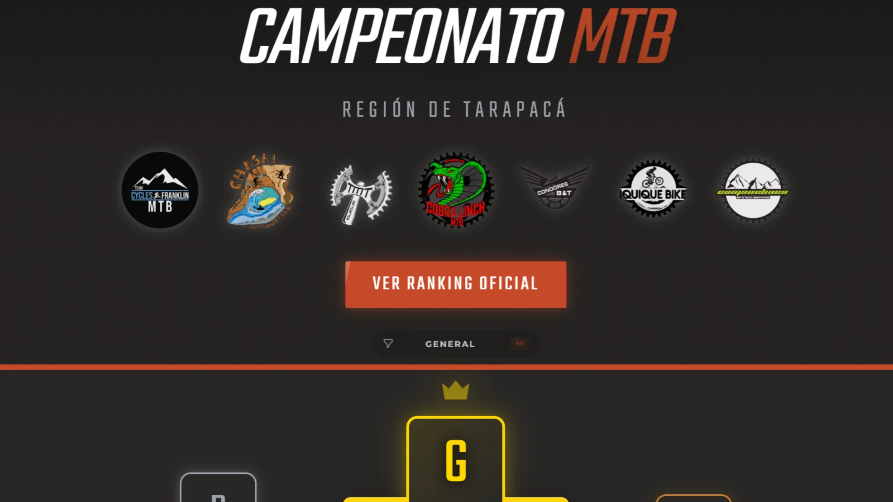
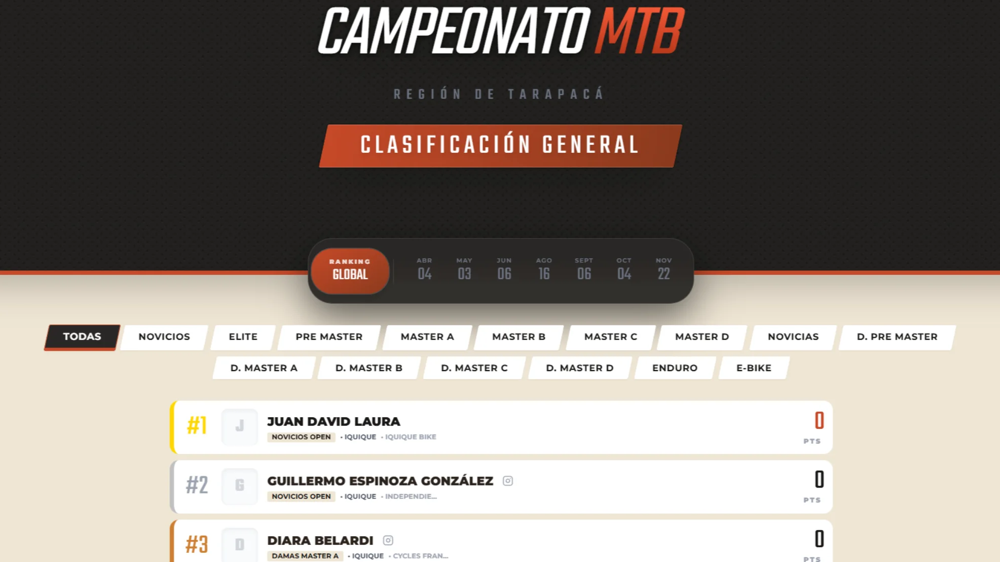
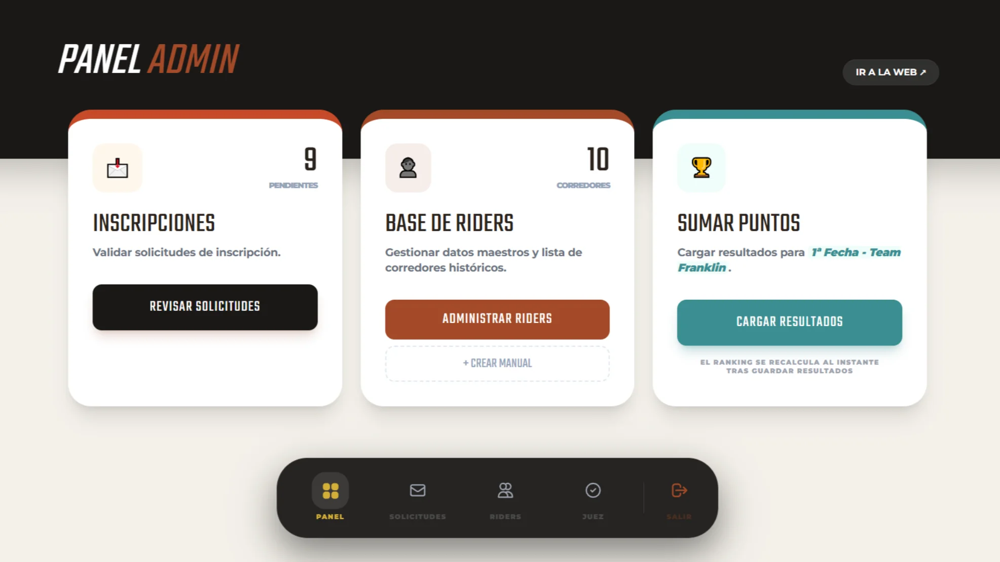

# Campeonato MTB Tarapacá

Plataforma web para la gestión de inscripciones, administración de fechas y visualización de resultados y clasificaciones del Campeonato MTB Tarapacá.

## Demo en Producción

La aplicación se encuentra disponible en: [campeonato-mtb.vercel.app](https://campeonato-mtb.vercel.app/)

## Capturas de Pantalla

| Dashboard de Gestión | Importación de Resultados | Clasificación / Leaderboard |
| :---: | :---: | :---: |
|  |  |  |

## Funciones Principales

- **Gestión de Inscripciones:** Formulario público con validación de RUT, datos de contacto y selección de categoría según el reglamento oficial.
- **Panel Administrativo:** Módulo protegido mediante Supabase Auth para la revisión y aprobación de solicitudes.
- **Asignación de Dorsales:** Asignación individual y en bloque de números de competencia correlativos, evitando duplicados por evento.
- **Exportación para Cronometraje:** Generación de archivos CSV con formato compatible para sistemas RaceTime y planillas Excel generales.
- **Asistente de Importación de Resultados:** Procesamiento de archivos PDF, Excel (.xls/.xlsx) y CSV con detección automática de tiempos, dorsales y vinculación de corredores.
- **Clasificación y Leaderboard:** Visualización del ranking general y por fecha para corredores y clubes, calculando puntajes históricos a partir de resultados y participación oficial.

## Modelo de Datos Resumido

El sistema estructura la información en cuatro entidades principales dentro de PostgreSQL:

- **`riders`**: Almacena el perfil único del corredor (RUT, nombre completo, categoría oficial, club, datos de contacto y patrocinadores).
- **`events`**: Registra cada fecha del campeonato (nombre, fecha de realización, estado del evento, valor de inscripción, información bancaria y términos).
- **`event_riders`**: Relaciona a un corredor con un evento específico, almacenando el dorsal asignado, la categoría disputada y el club al que representó en dicha fecha.
- **`results`**: Guarda las marcas de cronometraje oficiales de cada evento (tiempo registrado, posición obtenida y puntos asignados para la tabla general).

## Stack Tecnológico

- **Framework:** Next.js 16.1.6 (App Router, Turbopack)
- **Biblioteca UI:** React 19.2.3
- **Lenguaje:** TypeScript 5
- **Base de Datos y Autenticación:** Supabase / PostgreSQL
- **Estilos:** Tailwind CSS
- **Plataforma de Despliegue:** Vercel
- **Servicio de Correo:** Nodemailer

## Instalación Local

### Requisitos

- Node.js >= 20.9
- npm

### Pasos

1. Clonar el repositorio:
   ```bash
   git clone https://github.com/Tebias-cloud/Campeonato-MTB-leaderboard.git
   cd Campeonato-MTB-leaderboard
   ```

2. Instalar dependencias:
   ```bash
   npm install
   ```

3. Iniciar el servidor de desarrollo:
   ```bash
   npm run dev
   ```
   La aplicación estará disponible en [http://localhost:3000](http://localhost:3000).

4. Compilar para producción:
   ```bash
   npm run build
   ```

## Variables de Entorno

Crea un archivo `.env.local` en la raíz del proyecto tomando como referencia el archivo [.env.example](.env.example):

```ini
NEXT_PUBLIC_SUPABASE_URL=https://tu-proyecto.supabase.co
NEXT_PUBLIC_SUPABASE_ANON_KEY=sb_publishable_tu_clave_aqui
SUPABASE_SERVICE_ROLE_KEY=sb_secret_tu_clave_aqui
EMAIL_USER=tu-correo@gmail.com
EMAIL_PASS=tu-contraseña-de-aplicacion
```

### Notas sobre las variables:
- `NEXT_PUBLIC_SUPABASE_ANON_KEY`: Recibe una clave pública de cliente con prefijo `sb_publishable_...`.
- `SUPABASE_SERVICE_ROLE_KEY`: Recibe una clave de servicio con prefijo `sb_secret_...` para operaciones privilegiadas del lado del servidor.
- Nunca confirmes ni expongas valores reales o claves privadas en el control de versiones.

## Despliegue

La aplicación está preparada para su despliegue continuo en Vercel:

1. Importar el repositorio desde el panel de control de Vercel.
2. Configurar las variables de entorno detalladas anteriormente en la sección de configuración del proyecto.
3. El comando de compilación por defecto (`next build`) generará las rutas estáticas y dinámicas optimizadas.